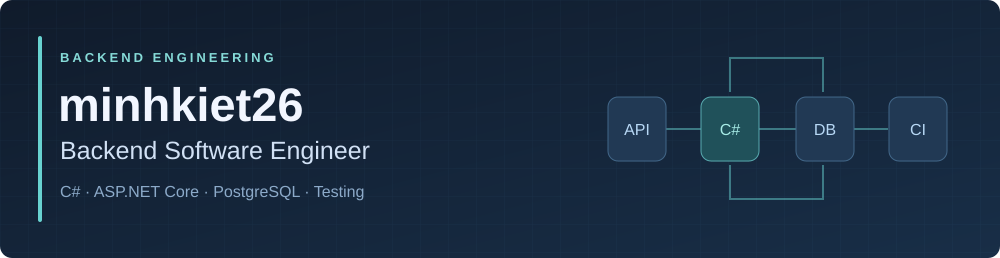
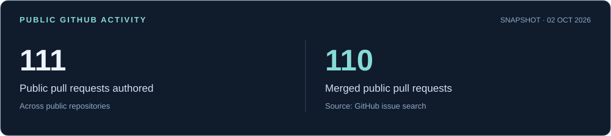

<strong>Business rules · API authorization · Automated tests</strong>

  
  
  

---

I build backend services with **C# and ASP.NET Core**, focusing on business rules, authorization, database access, and tests. My team contributions span **[Seal Hackathon Manager](https://github.com/Seal-Manager-Hackathon)** and **[VNZ-DNA](https://github.com/VNZ-DNA)**.

## 💻 Tech Stack

  
  
  
  
  

  
  
  
  
  

**Engineering focus:** layered backend services, REST API contracts, policy-based authorization, ownership checks, input validation, and CI delivery.

## 🚀 Featured Team Projects

### [SEAL Hackathon Management System](https://github.com/Seal-Manager-Hackathon/hkathon)

A .NET 8 / ASP.NET Core backend for hackathon registration, submissions, judging, and leaderboards, using **Entity Framework Core and PostgreSQL**.

- Implemented mentor/judge assignment and team ban/unban workflows, with role and event-assignment checks. [Merged PR →](https://github.com/Seal-Manager-Hackathon/BE-SEAL-HACKATHON/pull/92)
- Implemented personal notification feeds and read-state endpoints with ownership checks, keeping API documentation aligned with the implementation. [Merged PR →](https://github.com/Seal-Manager-Hackathon/BE-SEAL-HACKATHON/pull/112)
- Added [submission eligibility checks](https://github.com/Seal-Manager-Hackathon/hkathon/commit/7ea004a7371f20722577d4d5bb474c82f49acf78) and contributed [role-aware leaderboard filtering](https://github.com/Seal-Manager-Hackathon/hkathon/commit/866ae0a45696e1a14922d4eca6fc026ba25da97c).

[BE-SEAL-HACKATHON](https://github.com/Seal-Manager-Hackathon/BE-SEAL-HACKATHON) · [hkathon](https://github.com/Seal-Manager-Hackathon/hkathon) · [My hkathon commits](https://github.com/Seal-Manager-Hackathon/hkathon/commits/main/?author=minhkiet26)

### [VNZ Backend](https://github.com/VNZ-DNA/BE-VNZ-DNA) · Team project

A .NET 8 backend with separate API, service, repository, and test projects.

- Implemented multi-select admin filters for job posts and contacts, including input validation and HTTP error mapping.
- Added **xUnit tests** for filter combinations, invalid inputs, and excluding soft-deleted records using EF Core's in-memory provider.

[Review my implementation and tests →](https://github.com/VNZ-DNA/BE-VNZ-DNA/commit/2f1e6752e08edbe269cd719632676681734019c7)

## 🛠️ Additional Projects

| Project | Engineering focus |
| --- | --- |
| [Mentorship Backend](https://github.com/minhkiet26/PieaTeam-NET1-2-HOCMIENPHI) | C# API/service/repository layers; [GitHub Actions delivery](https://github.com/minhkiet26/PieaTeam-NET1-2-HOCMIENPHI/actions/runs/31417772915/workflow) with Docker image publishing, Buildx caching, and a Render deploy hook. |
| [Course Registration System](https://github.com/minhkiet26/PRJ_Final) | Java Servlets/JSP with controller, entity, and service layers; [enrollment approval and rejection](https://github.com/minhkiet26/PRJ_Final/blob/main/src/java/controller/ProcessEnrollmentController.java). |

## 📊 GitHub Activity

Public repository snapshot as of **2 October 2026**. [View authored PRs](https://github.com/pulls?q=is%3Apr+is%3Apublic+author%3Aminhkiet26) · [View merged PRs](https://github.com/pulls?q=is%3Apr+is%3Apublic+is%3Amerged+author%3Aminhkiet26)

## 🤝 Contact

For backend engineering opportunities: **[minhkietpham8@gmail.com](mailto:minhkietpham8@gmail.com)**.
